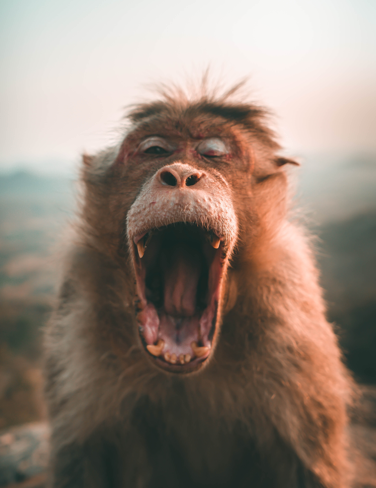
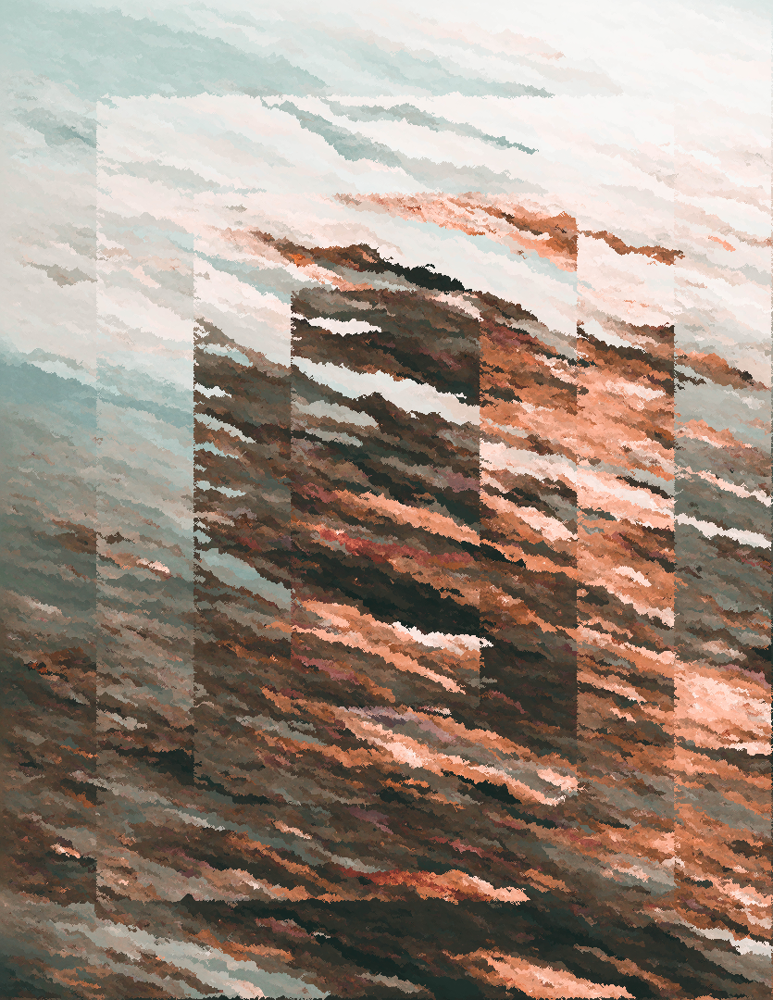
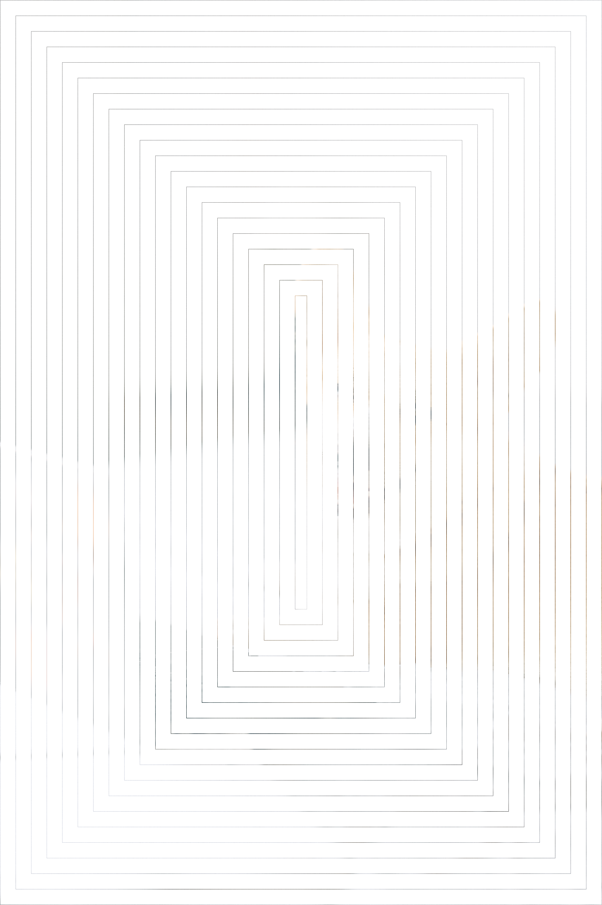
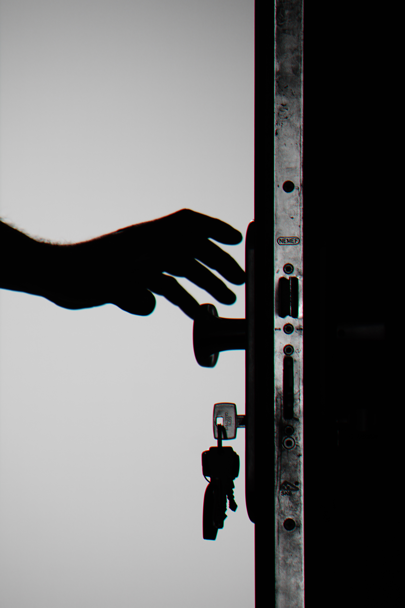
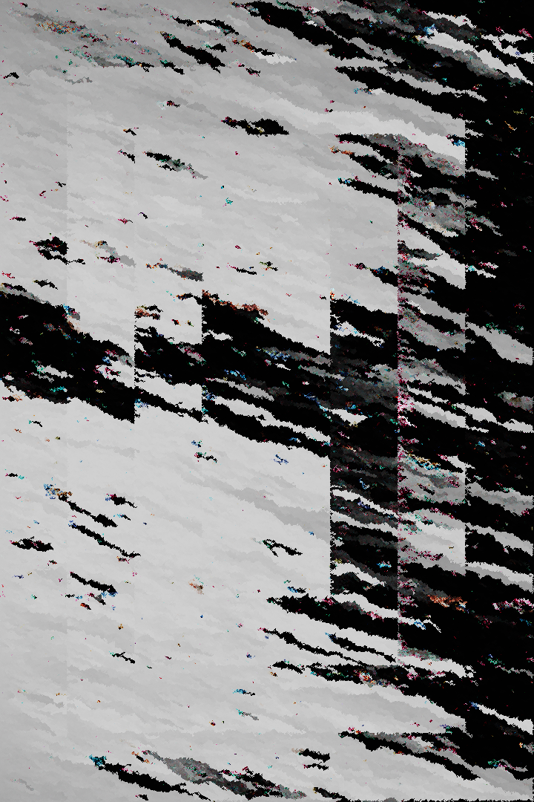

# Python Dream Bot

{{#include ../header.md}}

Intentionally Bad Image Manipulation

`Python Dream Bot` is almost complete. What is the dream bot? I'm glad you asked!

The `Python Dream Bot` (patent not pending), is an intentionally bad guessing algorithm based off of the logic used for my jekyll post generator (See the costs bot post).

In short it works like this:

1. It resizes the original picture to user specification.
1. It stares at a picture and remember what pixels are near other pixels.
   
1. It creates a copy of the original picture, but removes large sections of the picture.
   
1. It looks at whatever pixels exist on the copy and fill in the missing pixels.

The previous image was exaggerated to better show the process:

{{#include ../footer.md}}
